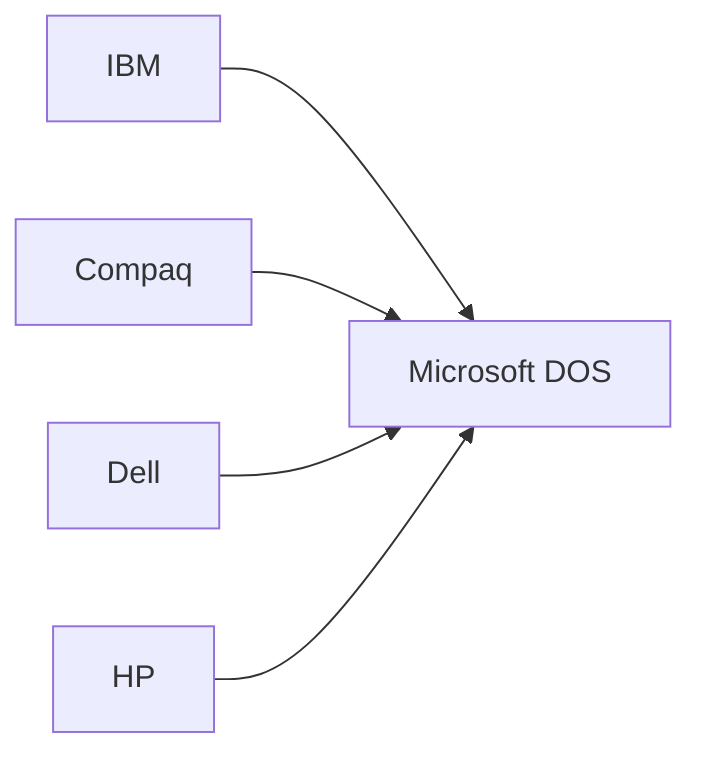

# Non-Exclusive OS Licensing Policy

## Policy Statement

Microsoft shall license its operating system software on a **non-exclusive basis** to all qualified OEM partners. No single customer, regardless of size or strategic importance, shall receive exclusive rights to Microsoft operating systems.

## Rationale

### The IBM Negotiation Context

When IBM approached Microsoft in 1980, they assumed they would receive exclusive rights to MS-DOS—the standard IBM approach for component suppliers.

Bill Gates and Paul Allen made the most consequential negotiating decision in technology history: **refuse exclusivity**.

### Strategic Logic

1. **IBM's market was guaranteed** — They would buy DOS regardless
2. **Clones were inevitable** — Intel chips + open architecture = competition
3. **Software scales infinitely** — One codebase serves unlimited customers
4. **Standards win** — Ubiquity creates network effects
5. **Protect independence** — Never be dependent on one customer

## Policy Details

### Licensing Terms

| Clause | Rationale |
|--------|-----------|
| Non-exclusive | Multiple OEMs can license same product |
| Per-copy royalty | Revenue scales with volume |
| Source code retained | Microsoft maintains control |
| Modification rights limited | Prevent incompatible forks |
| Marketing freedom | OEMs can brand (MS-DOS, PC-DOS, etc.) |

### What This Enabled

When Compaq reverse-engineered the IBM PC BIOS in 1982, they needed an operating system. Because of this policy, Microsoft could (and did) license DOS to Compaq—and every clone maker that followed.

**Result**: Hardware commoditized. Software captured value.

## Enforcement

### When IBM Objected

IBM pushed back on non-exclusivity. Microsoft's response:

1. **Offered lower pricing** — IBM got volume discounts
2. **Prioritized IBM features** — Technical support and customization
3. **Maintained principle** — Non-exclusivity was non-negotiable

### Internal Application

This policy applies to all Microsoft operating system products:
- MS-DOS
- Windows
- Windows NT
- Windows Server

No exceptions for "strategic" customers.

## Consequences

### Positive

1. **IBM clones licensed DOS** — Microsoft revenue grew 10x faster than IBM PC revenue
2. **Standard established** — "IBM compatible" meant "DOS compatible"
3. **Hardware commoditization** — OEMs competed on price, Microsoft captured margin
4. **Independence preserved** — No customer represented >15% of revenue after 1985

### Negative

1. **IBM relationship tension** — IBM felt betrayed
2. **Clone quality variance** — Not all OEMs maintained compatibility
3. **Support burden** — Multiple OEM configurations to test

## Historical Impact

This single policy decision is arguably the most important in Microsoft's history. It:

- Created the PC software industry structure
- Enabled Microsoft's 90%+ market share
- Prevented IBM from controlling the PC platform
- Established the business model for 40+ years

### Comparison: Apple's Approach

| Microsoft | Apple |
|-----------|-------|
| License to all | Hardware exclusive |
| Commoditize hardware | Integrated stack |
| 90%+ OS market share | 5-15% OS share |
| Lower margin, higher volume | Higher margin, lower volume |

## Related Records

- DEC-005: Partner with IBM
- DEC-006: Buy QDOS
- CUS-001: IBM Customer Profile
- PRC-001: OEM Licensing Program
- STR-001: Success Reinforces Success Strategy
