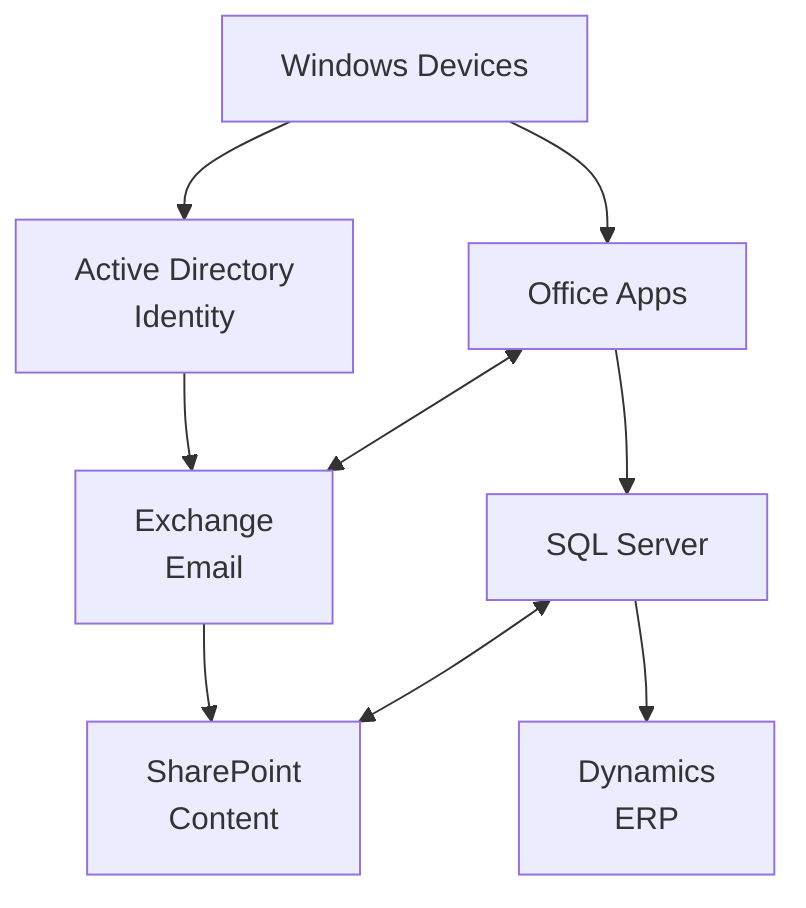

# Enterprise Systems Flywheel

## Strategic Context

After IBM departed in 1990 and the consumer market became increasingly contested (Netscape, Apple), Steve Ballmer recognized that the enterprise market offered defensible, recurring revenue streams. The key insight: enterprise customers don't buy individual products—they buy **integrated systems**.

## The Flywheel Model

Each component reinforces the others:
- Windows devices authenticate against Active Directory
- Office integrates deeply with Exchange calendaring
- SharePoint stores Office documents with versioning
- SQL Server powers everything

**The lock-in**: Once a company standardizes on this stack, the switching cost exceeds the cost of any individual product.

## Revenue Locomotives

Steve Ballmer's "Trick Pony" framework:

| Locomotive | Revenue Driver | Moat |
|------------|---------------|------|
| Desktop/Office | Per-seat licensing | Network effects, file format lock-in |
| Enterprise Servers | Active Directory + Exchange + SQL | Integration, switching costs |

Multi-billion dollar products launched during Ballmer era:
- SQL Server (x86 alternative to Oracle/mainframes)
- Exchange/Outlook (email backbone)
- SharePoint (enterprise content management)
- Dynamics (ERP systems)
- System Center (IT management)

## Pricing Innovation

The Enterprise Agreement model (PRC-002) bundled all products regardless of actual usage. This:
1. Reduced price sensitivity
2. Increased switching costs
3. Created predictable recurring revenue
4. Simplified procurement for IT departments

## Key Metrics (Ballmer Era)

| Metric | 2000 | 2014 |
|--------|------|------|
| Revenue | $23B | $87B |
| Profit | $9B | $22B |
| Enterprise % | ~30% | ~60% |

## Strategic Trade-offs

**Strengths:**
- Massive recurring revenue
- Deep customer relationships
- High switching costs
- Multi-year contracts

**Weaknesses:**
- Slower innovation cycles (enterprise moves slowly)
- Legacy compatibility constraints
- Missed consumer opportunities (mobile, social)
- "Platform company" mindset hindered app innovation

## Ballmer's Reflection

> "We tried to put Windows in places that it didn't naturally go."

The enterprise strategy succeeded brilliantly in its domain but created organizational constraints that made pivoting to mobile and consumer markets nearly impossible. The company optimized for extending existing franchises rather than building genuinely new capabilities.
