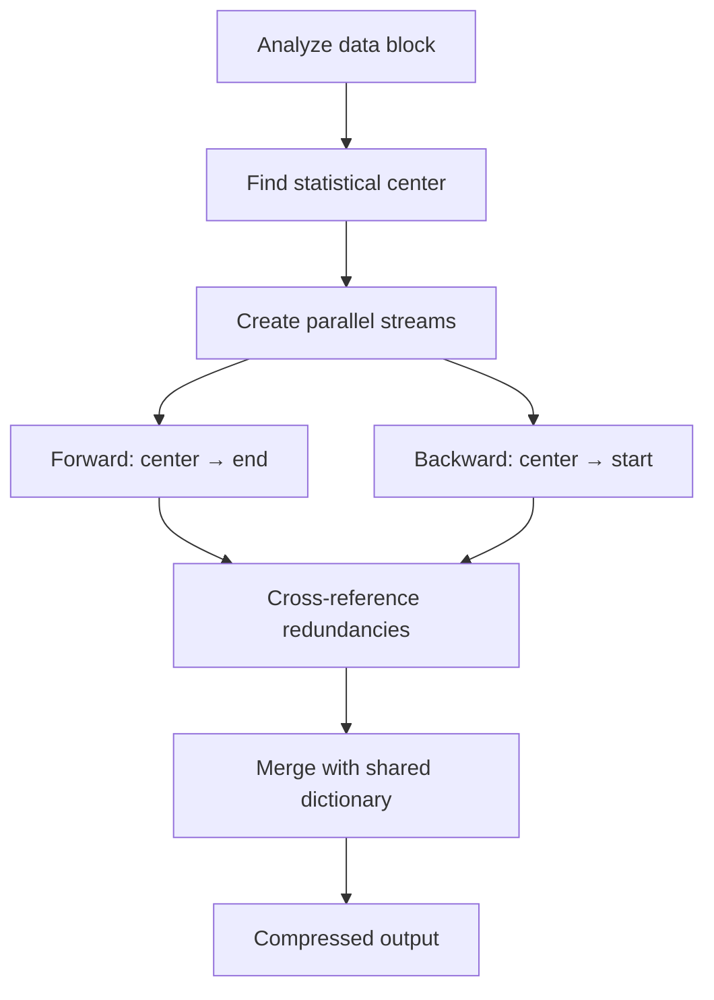

# Middle-Out Compression Algorithm

## Context

Standard compression algorithms use either bottom-up (Huffman coding) or top-down (Shannon coding) approaches. Both have theoretical limits that have constrained the industry for decades.

Richard Hendricks discovered a revolutionary "Middle-Out" approach while working on a music plagiarism detection app. The compression engine underlying the app demonstrated ratios that defied established theoretical limits.

## Decision

Implement bidirectional "Middle-Out" compression that starts from the statistical center of a data block and compresses outward in both directions simultaneously.

## Technical Details

### The Middle-Out Heuristic

```d2
direction: right

input: Raw Data Block {
  shape: document
}

center: Statistical Center {
  shape: diamond
  style.fill: "#4CAF50"
}

forward: Forward Stream {
  shape: hexagon
  style.fill: "#2196F3"
}

backward: Backward Stream {
  shape: hexagon
  style.fill: "#FF9800"
}

cross: Cross-Reference {
  shape: cylinder
  style.fill: "#9C27B0"
}

output: Compressed Output {
  shape: document
  style.fill: "#4CAF50"
}

input -> center: Find center
center -> forward: center → end
center -> backward: center → start
forward -> cross: Redundancies
backward -> cross: Redundancies
cross -> output: Merge with shared dictionary
```



### Weissman Score Achievement

The algorithm achieved a Weissman Score of **5.2** at TechCrunch Disrupt, breaking the previously believed theoretical maximum of 2.9.

$$W = \alpha \frac{r}{\bar{r}} \frac{\log(\bar{T})}{\log(T)}$$

Where:
- r = compression ratio achieved (our algorithm)
- r̄ = baseline compression ratio (GZIP)
- T = time for our algorithm
- T̄ = time for baseline
- α = scaling constant

### Performance Characteristics

| Data Type | Compression Ratio | Speed vs GZIP |
|-----------|-------------------|---------------|
| Text | 8.2:1 | 1.4x faster |
| 3D Video | 12.1:1 | 2.1x faster |
| Genomic | 15.3:1 | 1.8x faster |

## Consequences

### Positive
- Industry-leading compression technology
- Competitive moat against Hooli Nucleus
- Foundation for all future products (Platform, Box, PiperNet)

### Negative
- High complexity makes maintenance difficult
- Single point of failure if algorithm is compromised
- Triggered Hooli IP lawsuit (see INC-001)

## Implementation Notes

The algorithm is implemented in C with SIMD optimizations for parallel processing. GPU acceleration available via CUDA kernels.

```c
// Core middle-out entry point
int piper_compress(
    const uint8_t* input,
    size_t input_len,
    uint8_t* output,
    size_t* output_len,
    int compression_level
);
```
