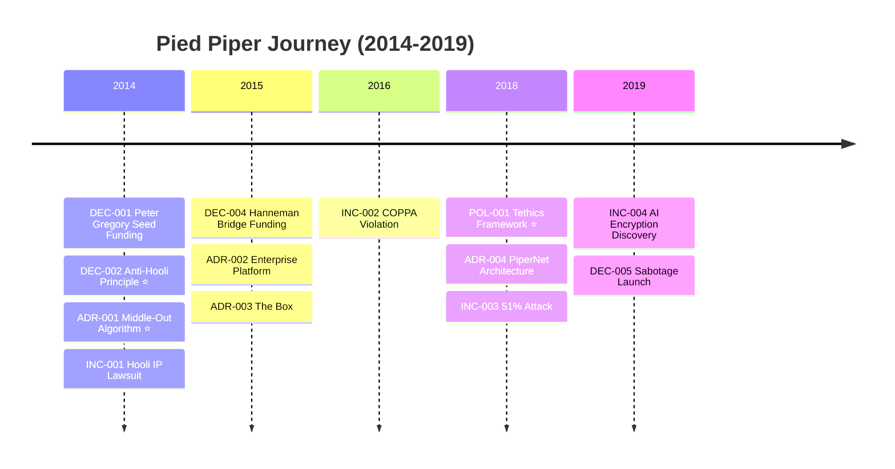

# New Employee Onboarding Guide

Welcome to Pied Piper! This guide will help you understand our company history, decision-making processes, and how to navigate our knowledge base.

## First Day Essentials

### 1. Understand Our Foundational Principles

Before anything else, read these three documents:

```bash
dg principles
```

This shows our **core records**—the core beliefs that guide every decision:

| Record | What It Tells You |
|--------|-------------------|
| **DEC-002** | Why we exist (Anti-Hooli principle) |
| **ADR-001** | Our core technology (Middle-Out compression) |
| **POL-001** | How we operate ethically (Tethics) |

### 2. Explore the Decision History

Our entire decision history is documented. To see all records:

```bash
dg list
```

Filter by type to focus on what matters to your role:

```bash
# For engineers
dg search type:adr

# For product managers
dg search type:decision

# For operations
dg search type:incident
```

### 3. Understand Dependencies

To see why a decision was made, trace its dependencies:

```bash
dg why ADR-004  # Why did we build PiperNet?
```

To see what depends on a decision:

```bash
dg impact DEC-002  # What does Anti-Hooli enable?
```

## Using the Decision Graph Website

Visit our internal documentation site (built with `dg serve`):

- **Records**: Browse all decisions, ADRs, incidents
- **Graph**: Visual map of how decisions connect
- **Stats**: Overview of our documentation coverage

## Understanding Our History

### The Journey (2014-2019)



### Key Lessons from Our History

1. **Principles matter** — DEC-002 guided us even to company death
2. **Legal risks are real** — INC-001 nearly killed us
3. **Regulatory compliance isn't optional** — INC-002 cost us everything
4. **Technical excellence alone isn't enough** — We had the best tech but still failed

## Quick Reference Commands

```bash
# Search for anything
dg search "compression"
dg search type:adr status:accepted

# View a specific record
dg show ADR-001

# See the full graph
dg graph

# Check for orphaned records
dg orphans

# View timeline
dg timeline

# Generate documentation site
dg build
dg serve --open
```

## Questions?

If you can't find an answer in the decision graph:
1. Search first: `dg search "<your question>"`
2. Check related records using `dg why` and `dg impact`
3. Ask your manager to point you to the right record
4. If it's truly undocumented, create a new record!

---

*"The best time to document a decision was when it was made. The second best time is now."*
